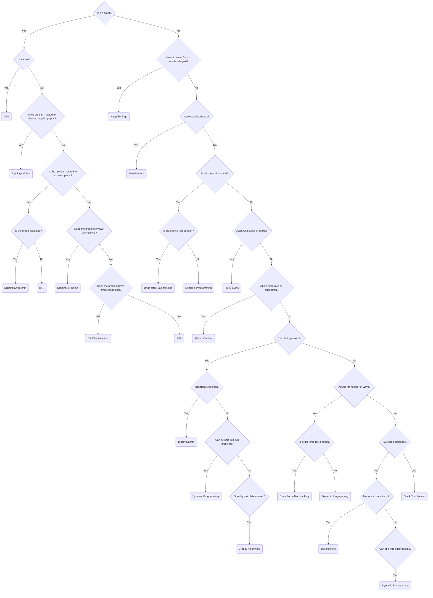

# 🚀 The Ultimate Technical Interview Guide


## Data Structures, Algorithms, and Patterns

### Introduction

Success in technical interviews requires a strategic, data-driven approach to preparation. This comprehensive guide provides a structured roadmap for mastering the most frequently tested concepts and patterns in coding interviews, helping you optimize your preparation time for maximum impact.

### Getting Started

Our preparation methodology focuses on high-return-on-investment (ROI) topics based on extensive analysis of interview patterns across major technology companies. By concentrating on the most commonly tested concepts, you can develop a strong foundation that translates directly to interview success.

### Overview

Technical interviews consistently evaluate candidates' proficiency in core computer science fundamentals through coding challenges. Understanding the underlying patterns in these challenges allows you to develop reusable problem-solving strategies rather than memorizing individual solutions.

### Key Focus Areas


#### Essential Patterns

The data reveals that three fundamental patterns appear most frequently in coding interviews:

**Depth-First Search (DFS)** serves as a versatile problem-solving approach, effectively addressing challenges involving trees, graphs, and combinatorial problems. Its widespread applicability makes it an essential technique to master.

**Breadth-First Search (BFS)** consistently appears in problems requiring level-wise traversal or finding shortest paths in unweighted graphs. Understanding BFS implementation and its common variations provides significant advantages in interviews.

**Two-Pointer** techniques frequently arise in array manipulation and string processing problems. Mastering this pattern enables efficient solutions to problems involving sliding windows, palindromes, and element matching.

#### Foundational Data Structures

Core data structures form the building blocks of efficient solutions:

**Arrays**, **Linked Lists**, **Hash Maps**, **Stacks**, and **Queues** represent fundamental concepts that appear regularly in interviews. While these topics may seem basic, their mastery is crucial as they often combine with advanced patterns to solve complex problems.

#### Advanced Topics

**Priority Queues** and **Heaps** appear more frequently than commonly expected, particularly in problems involving streaming data or maintaining ordered elements. Understanding these data structures provides advantages in specific interview scenarios.

**Dynamic Programming** and **Greedy Algorithms**, while important, require significant preparation time relative to their frequency in interviews. Focus on these areas after mastering the core patterns, unless interviewing with companies known to emphasize these topics.


### Dijkstra's Algorithm for Solving Problems

## Data Structures

### Stacks


A stack is one of the most fundamental data structures in computer science. It follows the Last-In-First-Out (LIFO) principle, meaning the last element added is the first one to be removed.

#### Basic Operations

##### Push

-   Adds an element to the top of the stack
-   Think of it like placing a plate on top of a stack of plates
```python title="stack.py" linenums="1"
def push(self, item):
    if len(self.stack) >= self.limit:
        raise StackOverflowError
    self.stack.append(item)
```
##### Pop

-   Removes and returns the top element from the stack
-   Like taking the topmost plate off a stack of plates
```python title="stack.py" linenums="1"
def pop(self):
    if not self.stack:
        raise StackUnderflowError
    return self.stack.pop()
```
##### Peek (or Top)

-   Returns the top element without removing it
-   Like looking at the top plate without taking it off
```python title="stack.py" linenums="1"
def peek(self):
    if not self.stack:
        raise StackUnderflowError
    return self.stack[-1]
```

#### Common Properties

##### Empty Check
```python title="stack.py" linenums="1"
def is_empty(self):
    return len(self.stack) == 0
```
##### Full Check
```python title="stack.py" linenums="1"
def is_full(self):
    return len(self.stack) == self.limit
```

#### Common Use Cases

1.  Function call stack (managing program execution)
2.  Undo operations in text editors
3.  Browser history (back button functionality)
4.  Expression evaluation in calculators
5.  Backtracking algorithms

#### Implementation Example
```python title="stack.py" linenums="1"
class Stack:
    def __init__(self, limit=10):
        self.stack = []
        self.limit = limit
    
    def push(self, item):
        if len(self.stack) >= self.limit:
            raise StackOverflowError
        self.stack.append(item)
    
    def pop(self):
        if not self.stack:
            raise StackUnderflowError
        return self.stack.pop()
    
    def peek(self):
        if not self.stack:
            raise StackUnderflowError
        return self.stack[-1]
    
    def is_empty(self):
        return len(self.stack) == 0
```

### Queues


A queue is a fundamental data structure that follows the First-In-First-Out (FIFO) principle, meaning the first element added is the first one to be removed. Think of it like a line of people waiting - the first person to join the line is the first to be served.

#### Basic Operations

##### Enqueue (Put)

-   Adds an element to the back of the queue
-   Like a person joining the end of a line
```python title="queue.py" linenums="1"
def put(self, item):
    self.queue.append(item)
```

##### Dequeue (Get)

-   Removes and returns the front element from the queue
-   Like the first person in line being served and leaving
```python title="queue.py" linenums="1"
def get(self):
    if not self.queue:
        raise IndexError("Queue is empty")
    return self.queue.pop(0)
```

##### Peek (Front)

-   Returns the front element without removing it
-   Like checking who's first in line without serving them
```python title="queue.py" linenums="1"
def get_front(self):
    if not self.queue:
        raise IndexError("Queue is empty")
    return self.queue[0]
```
#### Common Properties

##### Length Check
```python title="queue.py" linenums="1"
def __len__(self):
    return len(self.queue)
```

##### Is Empty
```python title="queue.py" linenums="1"
def is_empty(self):
    return len(self.queue) == 0
```

#### Implementation Example

Here's a simple implementation of a queue:
```python title="queue.py" linenums="1"
class Queue:
    def __init__(self):
        self.queue = []
    
    def put(self, item):
        self.queue.append(item)
    
    def get(self):
        if not self.queue:
            raise IndexError("Queue is empty")
        return self.queue.pop(0)
    
    def get_front(self):
        if not self.queue:
            raise IndexError("Queue is empty")
        return self.queue[0]
    
    def is_empty(self):
        return len(self.queue) == 0
```

#### Common Use Cases

1.  Print job scheduling in printers
2.  Process scheduling in operating systems
3.  Breadth-first search in graphs
4.  Customer service systems
5.  Message buffers in communication systems

#### Important Notes

1.  Unlike stacks, queues process elements in the order they were added
2.  The internal list implementation shown here is simple but not optimal for large queues (due to pop(0) being O(n))
3.  Python's  `collections.deque`  is more efficient for real-world applications
4.  Queues can have variations like priority queues or circular queues

### Singly Linked List


A singly linked list works like a chain, where each link (node) points to the next link. Think of it as a train where each car (node) is connected to the next car in line. Let me explain each key operation in simple terms.

#### Basic Structure

##### Node
```python title="list.py" linenums="1"
class Node:
    def __init__(self, data):
        self.data = data  # Stores the actual value
        self.next = None  # Points to the next node, like a pointer to the next train car
```

#### Core Operations

##### Insert at Beginning (Head)
```python title="list.py" linenums="1"
def insert_head(self, data):
    new_node = Node(data)
    new_node.next = self.head  # New node points to current first node
    self.head = new_node      # Make new node the first node
```
Think of this as adding a new car to the front of the train. The new car needs to be hooked up to the existing front car, then becomes the new front of the train.

##### Insert at End (Tail)
```python title="list.py" linenums="1"
def insert_tail(self, data):
    new_node = Node(data)
    if not self.head:         # If list is empty
        self.head = new_node  # New node becomes the head
        return
    
    current = self.head       # Start at the front
    while current.next:       # Walk to the end
        current = current.next
    current.next = new_node   # Add new node at the end
```
Like adding a new car to the end of the train. We need to walk all the way to the last car first, then attach our new car to it.

##### Insert at Index
```python title="list.py" linenums="1"
def insert_nth(self, index, data):
    new_node = Node(data)
    if index == 0:                # If inserting at front
        new_node.next = self.head # Do the same as insert_head
        self.head = new_node
        return
        
    current = self.head           # Start at front
    for _ in range(index - 1):    # Walk to position just before index
        current = current.next
    
    new_node.next = current.next  # New node points to next node
    current.next = new_node       # Previous node points to new node
```
Imagine adding a train car in the middle of the train. You need to walk to the right spot, unhook the connection there, and insert the new car by connecting it on both sides.

##### Delete from Beginning
```python title="list.py" linenums="1"
def delete_head(self):
    if not self.head:          # If list is empty, can't delete
        raise IndexError("List is empty")
    data = self.head.data      # Remember the value we're removing
    self.head = self.head.next # Second node becomes the new head
    return data                # Return removed value
```
Like removing the first car of the train. You just need to make the second car the new front of the train.

##### Delete at Index
```python title="list.py" linenums="1"
def delete_nth(self, index):
    if index == 0:             # If deleting first node
        data = self.head.data  # Do the same as delete_head
        self.head = self.head.next
        return data
        
    current = self.head        # Start at front
    for _ in range(index - 1): # Walk to node just before the one to delete
        current = current.next
        
    data = current.next.data   # Remember value being removed
    current.next = current.next.next  # Skip over the removed node
    return data
```
Similar to removing a car from the middle of the train. Walk to the spot just before it, then reconnect the cars on either side, bypassing the car you're removing.